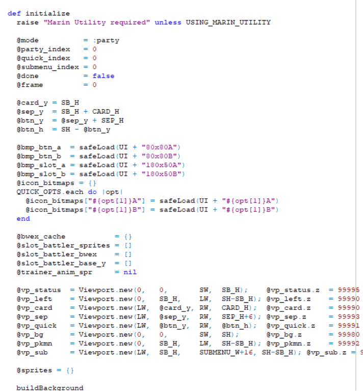
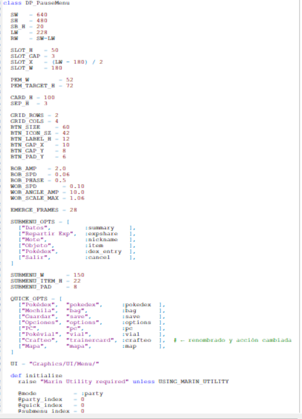
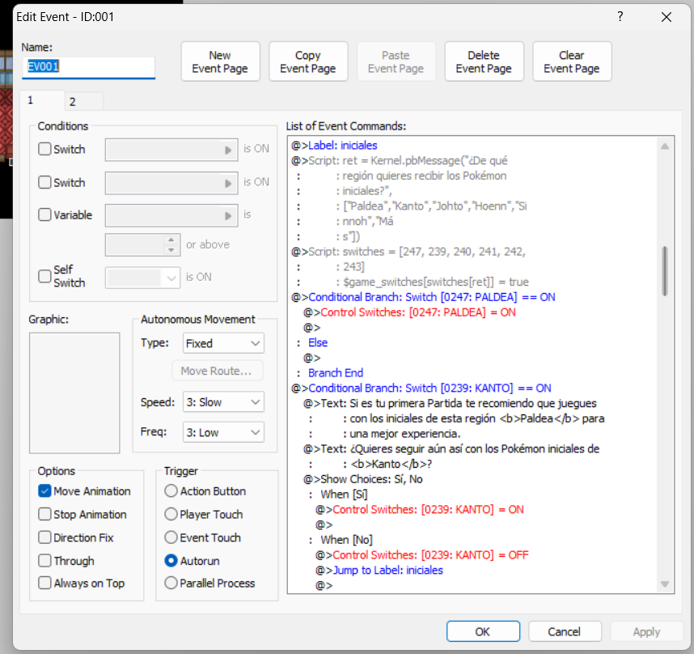
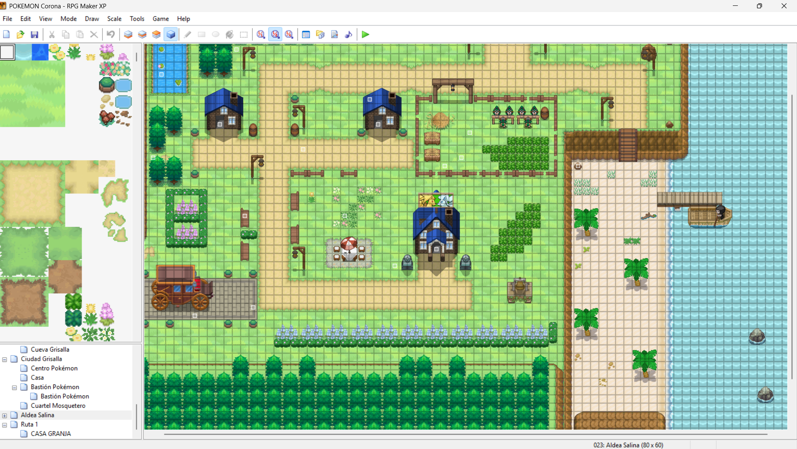

# 03. Entorn i prototip

## 1. Evidències del treball fet fins ara

En aquesta fase s’ha desenvolupat un primer prototip funcional del videojoc utilitzant Pokémon Essentials i RPG Maker XP.

Actualment el projecte inclou:
- Pantalla principal funcional.
- Menú de pausa personalitzat.
- Sistema de portes i teletransport entre mapes.
- Event per escollir el Pokémon inicial.
- Possibilitat d’escollir Pokémon de qualsevol generació.
- Primera ruta jugable.
- Sistema base de combats implementat.
- Navegació funcional entre zones i mapes.

El jugador ja pot iniciar una partida, moure’s pel mapa, interactuar amb events i accedir als sistemes principals del joc.

---

## 2. IDE utilitzat i configuració bàsica

Per desenvolupar el projecte he utilitzat:
- RPG Maker XP
- Pokémon Essentials
- Scripts en Ruby per modificar funcionalitats del joc

Configuració bàsica realitzada:
- Creació i organització dels primers mapes.
- Configuració de transferències entre zones.
- Creació d’events interactius.
- Implementació de scripts personalitzats.
- Adaptació del sistema de menús.
- Configuració inicial del sistema de combats.

---

## 3. Decisions inicials d’implementació

Les primeres decisions del projecte han estat:
- Prioritzar una base funcional abans d’afegir contingut avançat.
- Implementar primer els sistemes principals del joc:
  - moviment
  - menús
  - combats
  - selecció del Pokémon inicial
- Permetre escollir Pokémon de qualsevol generació per donar més varietat al jugador.
- Crear una estructura de mapes simple i fàcil d’ampliar.
- Desenvolupar una interfície pròpia en lloc d’utilitzar únicament els menús originals de Pokémon Essentials.
- Organitzar el projecte de manera modular per facilitar futures millores.

---

## 3.1 Sistema de menú personalitzat

S’ha desenvolupat un menú de pausa completament personalitzat mitjançant scripts en Ruby.

Característiques implementades:
- Disseny inspirat en interfícies modernes tipus smartphone/Discord.
- Animacions d’entrada i moviment.
- Sistema visual per als Pokémon de l’equip.
- Barra de vida dinàmica.
- Menú ràpid amb accessos directes.
- Submenús interactius per gestionar Pokémon.
- Sistema de sprites animats.
- Efectes visuals i ressaltat d’opcions seleccionades.
- Sistema de navegació entre menús.

Opcions disponibles al menú:
- Pokédex
- Motxilla
- Guardar
- Opcions
- PC
- Pokévial
- Sistema de crafteig
- Mapa

Aquest sistema ha estat programat modificant scripts de Pokémon Essentials i adaptant-los a les necessitats del projecte.

---

## 4. Captures de pantalla

S’adjunten captures de:
- Pantalla principal del joc.
- Menú de pausa personalitzat.
- Event de selecció del Pokémon inicial.
- Sistema de teletransport entre mapes.
- Vista del projecte dins RPG Maker XP.

Exemple:
**Pantalla de Titulo**

**Menu Pausa**

**Pokemon Inicial Escoger**

**Vista del Primer pueblo RPGMAKERXP**

---

## 5. Condicions mínimes

El prototip actual compleix les condicions mínimes perquè:
- El joc inicia correctament.
- Existeix navegació funcional entre mapes.
- El jugador pot interactuar amb events.
- El sistema de combats funciona de manera bàsica.
- Es pot seleccionar un Pokémon inicial.
- Hi ha una primera ruta completament accessible.
- Existeix un sistema de menú funcional i personalitzat.

---

## 6. Resum final

Aquesta fase ha servit per crear una primera versió funcional del projecte i establir les bases principals del desenvolupament del videojoc.

El projecte ja disposa dels sistemes principals necessaris per continuar ampliant contingut en futures fases.